## Part 1. Готовый докер

- Возьми официальный докер-образ с nginx и выкачай его при помощи `docker pull`

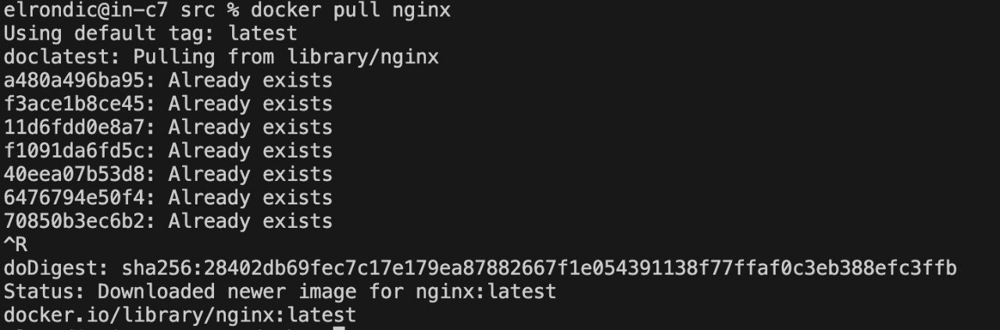

- Проверь наличие докер-образа через `docker images`

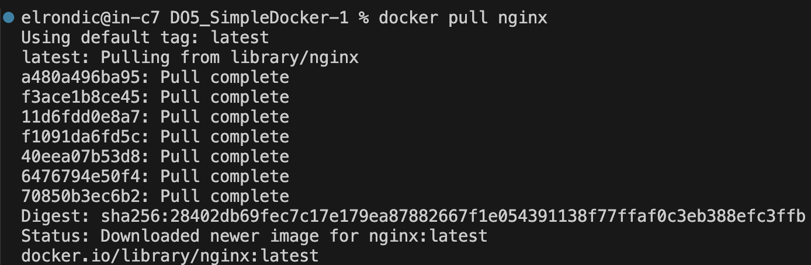

- Запусти докер-образ через `docker run -d [image_id|repository]`

- Проверь, что образ запустился через `docker ps`

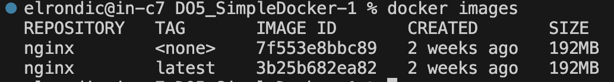

- Посмотреть информацию о контейнере через docker inspect [container_id|container_name]. 
  По выводу команды определить и поместить в отчёт размер контейнера, список замапленных портов и ip контейнера

  Размер контейнера:

  Общий размер всех файлов в контейнере - SizeRootFs
  Размер файлаов, которыу подверглись изменению, по сравнению с его прошлым образом - SizeRw

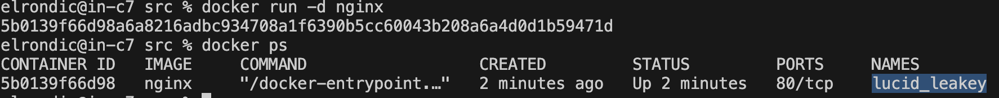

- IP-адрес контейнера: 172.17.0.2

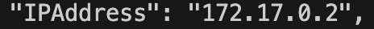

- Замапленный порт: 80

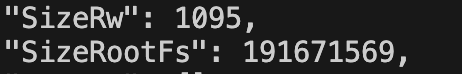

- Останови докер образ через `docker stop [container_id|container_name]`

- Запусти докер с портами 80 и 443 в контейнере, замапленными на такие же порты на локальной машине, через команду `run`
- Проверь, что образ запустился через `docker ps`:

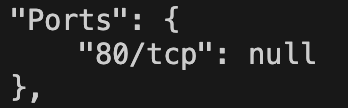

- Проверь, что в браузере по адресу localhost:80 доступна стартовая страница nginx

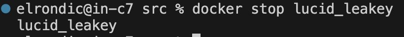

- Перезапусти докер контейнер через `docker restart [container_id|container_name]`
- Проверь любым способом, что контейнер запустился:

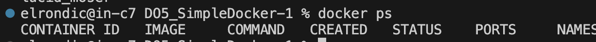

---
---

## Part 2. Операции с контейнером

- Прочитай конфигурационный файл `nginx.conf` внутри докер контейнера через команду `exec`

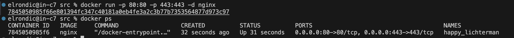

- Создай на локальной машине файл `nginx.conf`
- Настрой в нем по пути /status отдачу страницы статуса сервера nginx.

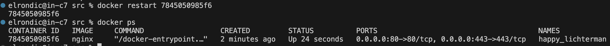

- Скопируй созданный файл `nginx.conf` внутрь докер-образа через команду `docker cp`

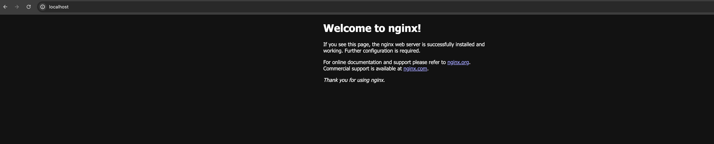

- Перезапусти nginx внутри докер-образа через команду `exec`

- Проверь, что по адресу `localhost:80/status` отдается страничка со статусом сервера nginx.

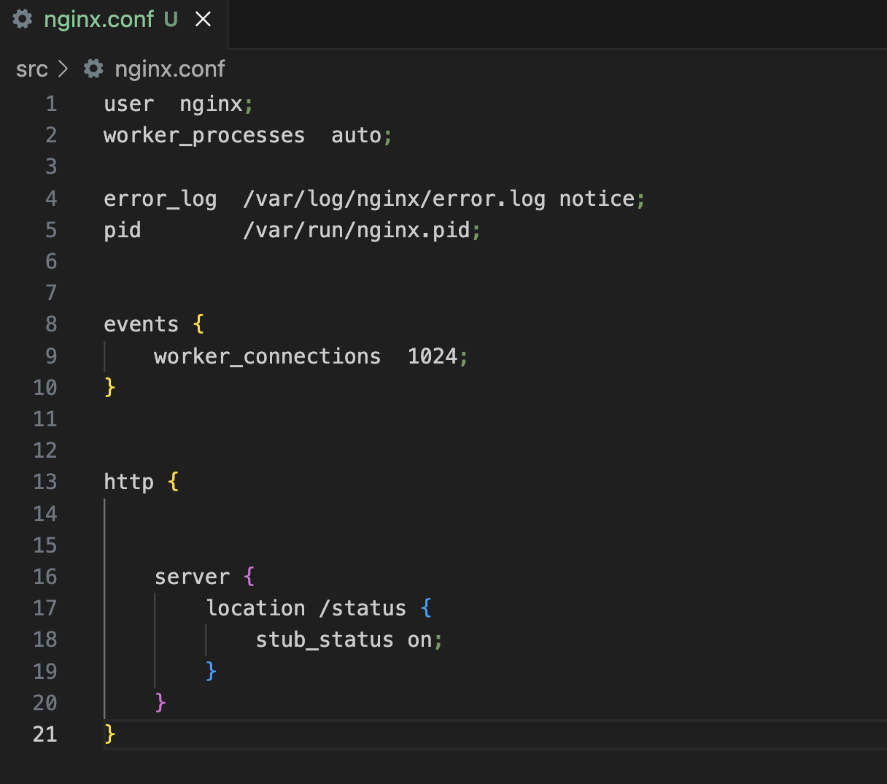

- Экспортируй контейнер в файл `container.tar` через команду `export`

- Останови контейнер.

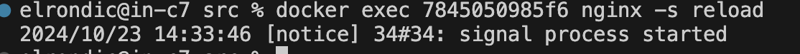

- Удали образ через `docker rmi [image_id|repository]`, не удаляя перед этим контейнеры.

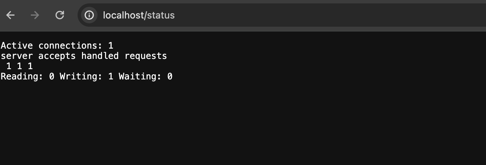

- Удали остановленный контейнер

- Импортируй контейнер обратно через команду `import`

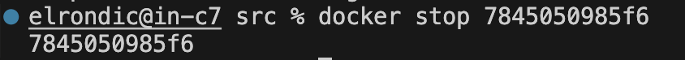

- Запусти импортированный контейнер

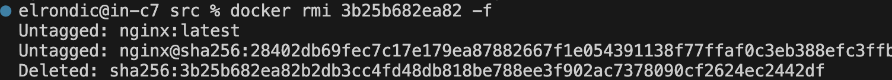

- Проверь, что по адресу `localhost:80/status` отдается страничка со статусом сервера nginx

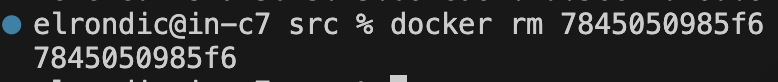

---
---

## Part 3. Мини веб-сервер

- Напиши мини-сервер на C и FastCgi, который будет возвращать простейшую страничку с надписью Hello World!.

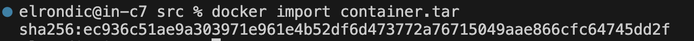

- Напиши свой nginx.conf, который будет проксировать все запросы с 81 порта на 127.0.0.1:8080.

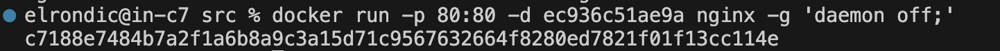

- Скопируй созданный nginx.conf и мини сервер в контейнер

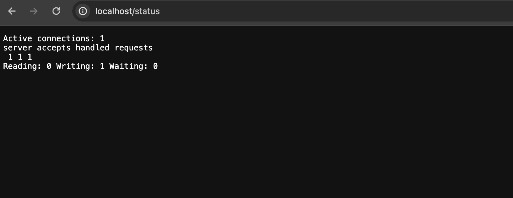

- Заходим в контейнер, устанавливаем gcc, spawn-fcgi и libfcgi-dev

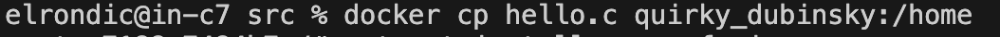

- Скомпилировали и запустили написанный мини сервер через spawn-fcgi на порту 8080

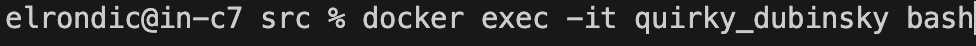

- Примени изменения в настройках сервера:

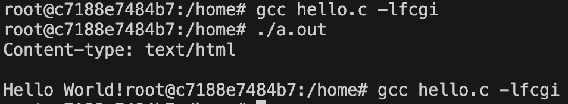

- Проверь, что в браузере по localhost:81 отдается написанная тобой страничка.

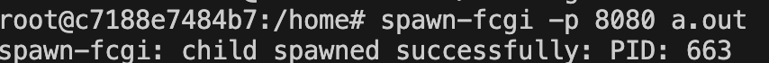

## Part 4. Свой докер

- Напиши свой докер-образ, который:

1) собирает исходники мини сервера на FastCgi из Части 3, копирует внутрь образа написанный ./nginx/nginx.conf;

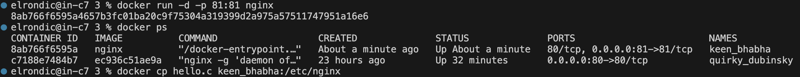

2) запускает его на 8080 порту;

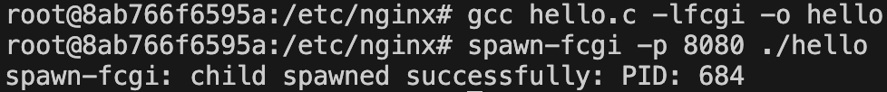

3) запускает nginx

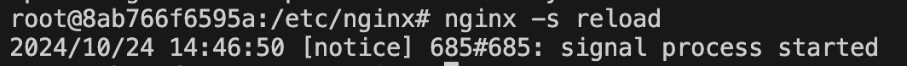

- Собери написанный докер-образ через `docker build` при этом указав имя и тег (`docker build -t part4:v1 .`)

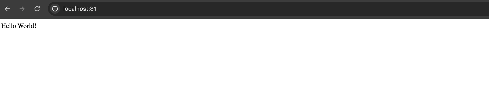

- Проверь через `docker images`, что все собралось корректно

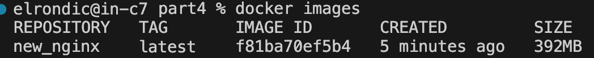

- Запусти собранный докер-образ с маппингом 81 порта на 80 на локальной машине и маппингом папки ./nginx внутрь контейнера по адресу, где лежат конфигурационные файлы nginx'а (`docker run -d -p 80:81 -v $(pwd)/nginx/nginx.conf:/etc/nginx/nginx.conf new_nginx:latest`)

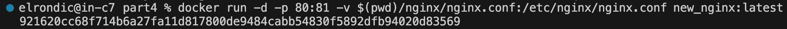

- Проверь, что по localhost:80 доступна страничка написанного мини сервера.

- Допиши в ./nginx/nginx.conf проксирование странички /status, по которой надо отдавать статус сервера nginx

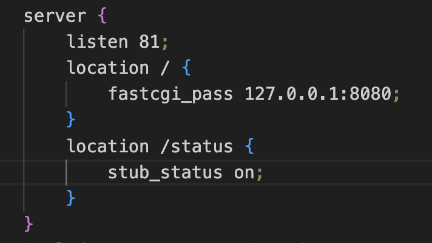

- Перезапусти докер-образ. Проверь, что теперь по localhost:80/status отдается страничка со статусом nginx

---
---

## Part 5. Dockle

- Просканируй образ из предыдущего задания через dockle [image_id|repository].

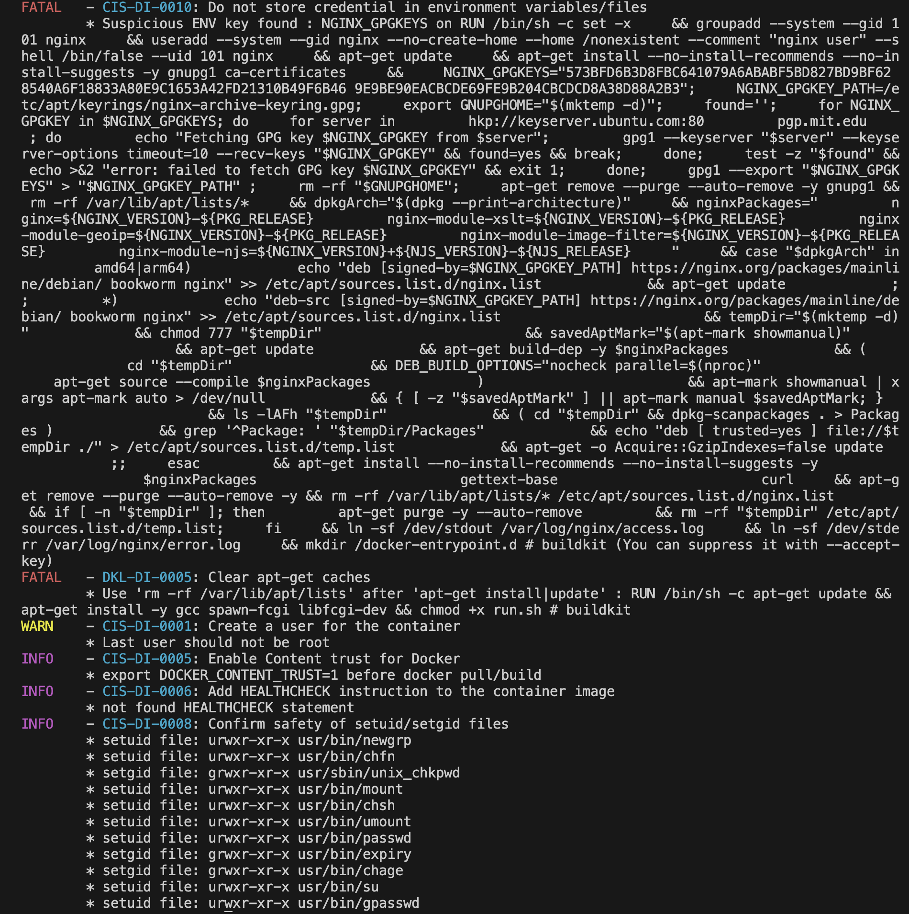

- Исправь образ так, чтобы при проверке через dockle не было ошибок и предупреждений

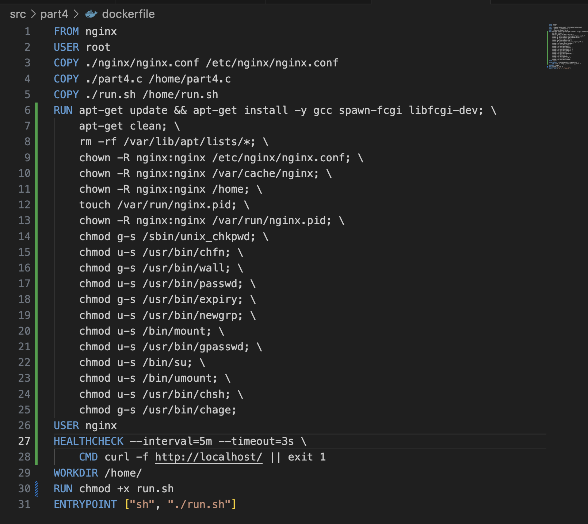

- Просканируй образ:

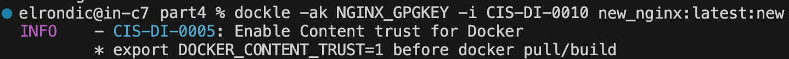

---
---

## Part 6. Базовый Docker Compose

- Напиши файл docker-compose.yml, с помощью которого:

1) Подними докер-контейнер из Части 5 (он должен работать в локальной сети, т.е. не нужно использовать инструкцию EXPOSE и мапить порты на локальную машину).
2) Подними докер-контейнер с nginx, который будет проксировать все запросы с 8080 порта на 81 порт первого контейнера.

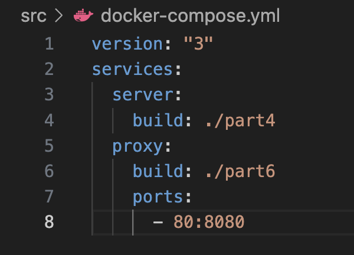

- Замапь 8080 порт второго контейнера на 80 порт локальной машины.

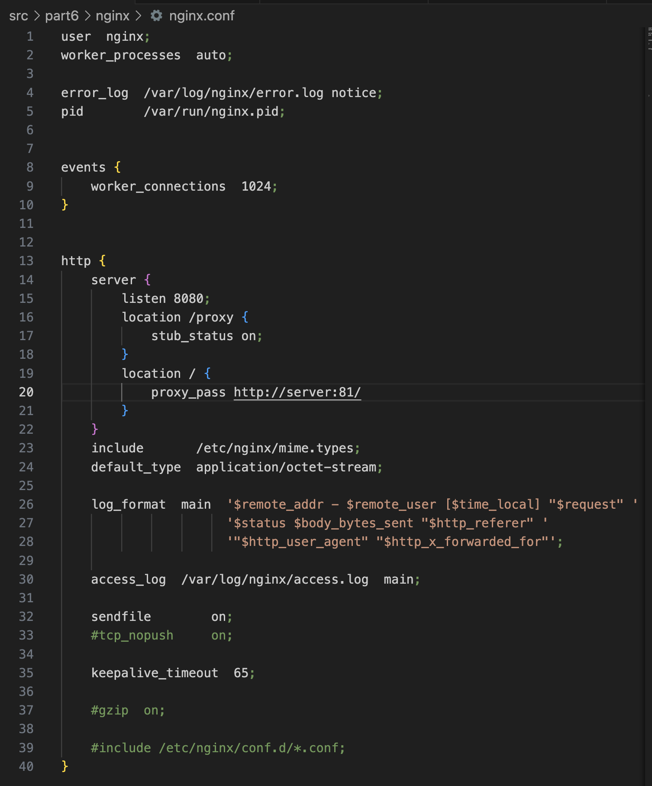

- Останови все запущенные контейнеры. Собери и запусти проект с помощью команд `docker-compose build`

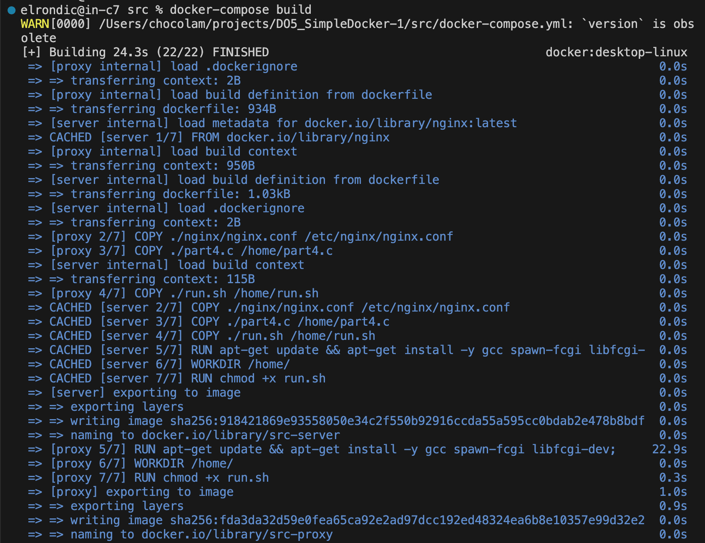

  и `docker-compose up`

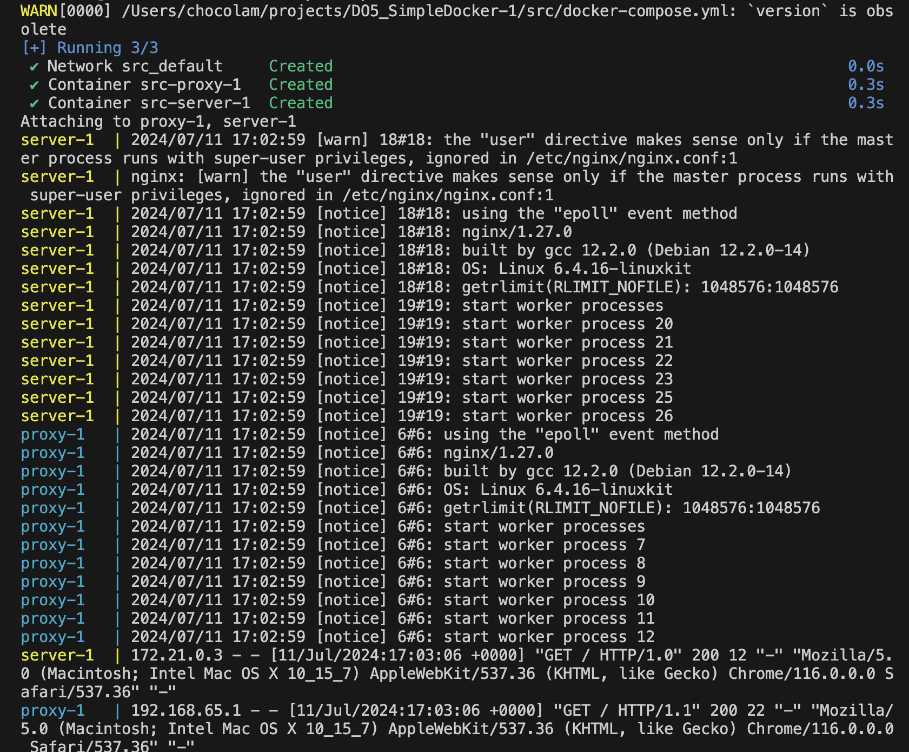

- Проверь, что в браузере по localhost:80 отдается написанная тобой страничка, как и ранее

 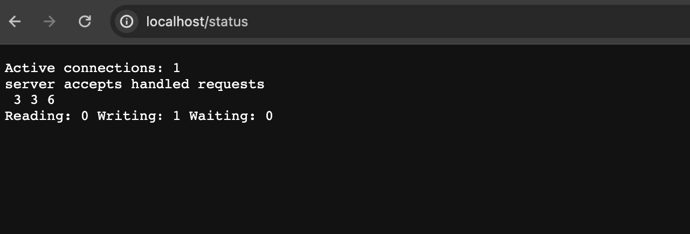